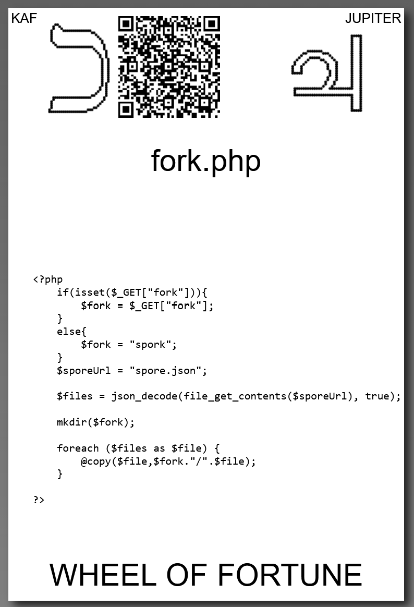

# [fork.php](https://github.com/LafeLabs/spore/tree/main/tarot/spore/10)

[fork.php](https://github.com/LafeLabs/spore/blob/main/list-files.php) IS A [PHP](https://en.wikipedia.org/wiki/PHP) SCRIPT WHITCH FORKS THE SPORE TREE.

## [fork.php](https://github.com/LafeLabs/spore/blob/main/fork.php) CODE:

```
    if(isset($_GET["fork"])){
        $fork = $_GET["fork"];
    }
    else{
        $fork = "spork";
    }
    $sporeUrl = "spore.json";
    $files = json_decode(file_get_contents($sporeUrl), true);
    mkdir($fork);
    foreach ($files as $file) {
        @copy($file,$fork."/".$file);
    }

```

## isset
## _GET
## if...else
## json_decode
## file\_get\_contents
## mkdir
## foreach
## copy



# [WHEEL OF FORTUNE](https://en.wikipedia.org/wiki/Wheel_of_Fortune_(tarot_card))


USE 4 BY 6 INCH THERMAL PRINTER TO PRINT STIKERS AND PUT THEM ON THE CARDBOARD!

# [METASPORE](https://metaspore.net/tarot/spore/10/)
# [LOCALHOST](http://localhost/spore/tarot/spore/10/)
# [LOCALHOST/HERE](http://localhost/spore/tarot/spore/10/readme.html)

