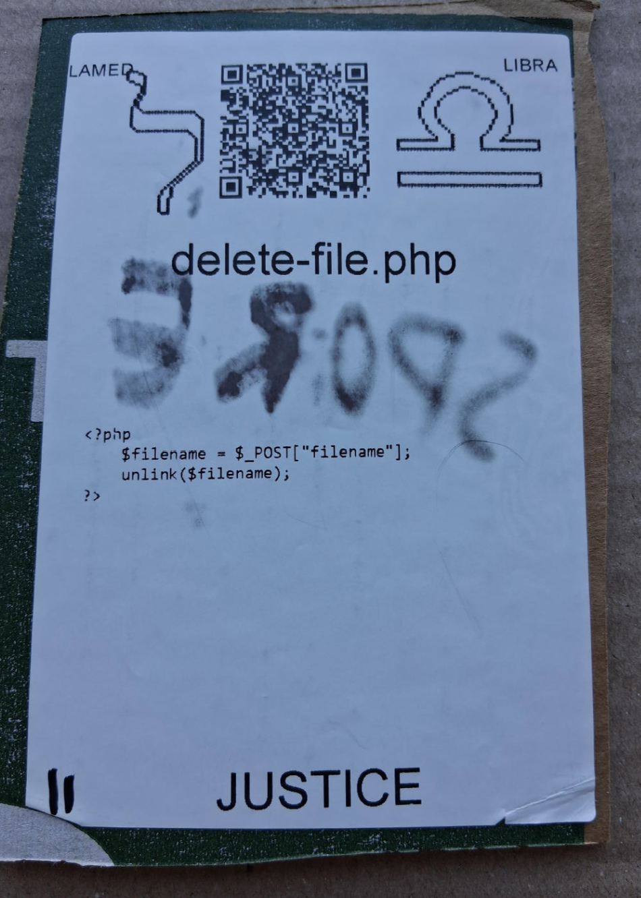

# [delete-file.php](https://github.com/LafeLabs/spore/tree/main/tarot/spore/11)

[delete-file.php](https://github.com/LafeLabs/spore/blob/main/list-files.php) IS A [PHP](https://en.wikipedia.org/wiki/PHP) SCRIPT WHICH DELETES FILES.

## [fork.php](https://github.com/LafeLabs/spore/blob/main/fork.php) CODE:

```
 <?php
    $filename = $_POST["filename"];
    unlink($filename);
?>
```



# [JUSTICE](https://en.wikipedia.org/wiki/Justice_(tarot_card))


USE 4 BY 6 INCH THERMAL PRINTER TO PRINT STIKERS AND PUT THEM ON THE CARDBOARD!

# [METASPORE](https://metaspore.net/tarot/spore/10/)
# [LOCALHOST](http://localhost/spore/tarot/spore/10/)
# [LOCALHOST/HERE](http://localhost/spore/tarot/spore/10/readme.html)

