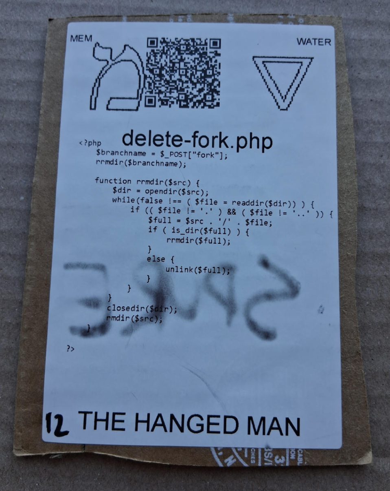

# [delete-fork.php](https://github.com/LafeLabs/spore/tree/main/tarot/spore/12)

[delete-fork.php](https://github.com/LafeLabs/spore/blob/main/list-files.php) IS A [PHP](https://en.wikipedia.org/wiki/PHP) SCRIPT WHICH DELETES FORKS.

# [THE HANGED MAN](https://en.wikipedia.org/wiki/The_Hanged_Man_(tarot_card))

USE 4 BY 6 INCH THERMAL PRINTER TO PRINT STIKERS AND PUT THEM ON THE CARDBOARD!

# [METASPORE](https://metaspore.net/tarot/spore/12/)
# [LOCALHOST](http://localhost/spore/tarot/spore/12/)
# [LOCALHOST/HERE](http://localhost/spore/tarot/spore/12/readme.html)

