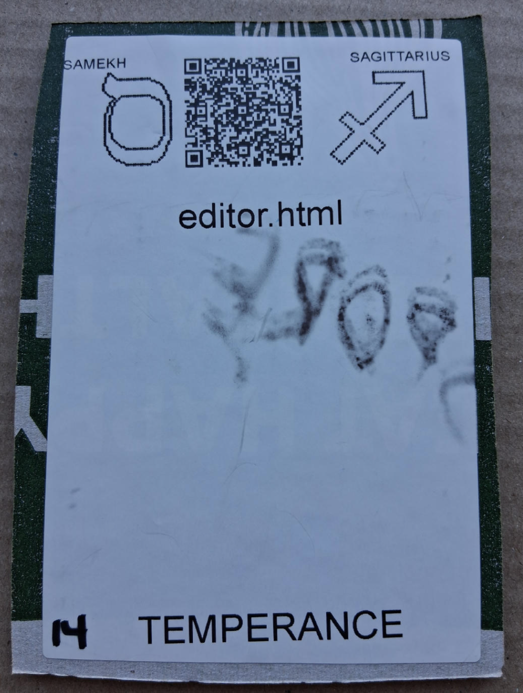

# [editor.html](https://github.com/LafeLabs/spore/tree/main/tarot/spore/14)

[editor.html](https://github.com/LafeLabs/spore/blob/main/editor.html) IS A WEB PAGE WHICH EDITS THE WHOLE SPORE SET!

# [TEMPERANCE](https://en.wikipedia.org/wiki/Temperance_(tarot_card))

USE 4 BY 6 INCH THERMAL PRINTER TO PRINT STIKERS AND PUT THEM ON THE CARDBOARD!

# [METASPORE](https://metaspore.net/tarot/spore/14/)
# [LOCALHOST](http://localhost/spore/tarot/spore/14/)
# [LOCALHOST/HERE](http://localhost/spore/tarot/spore/14/readme.html)
