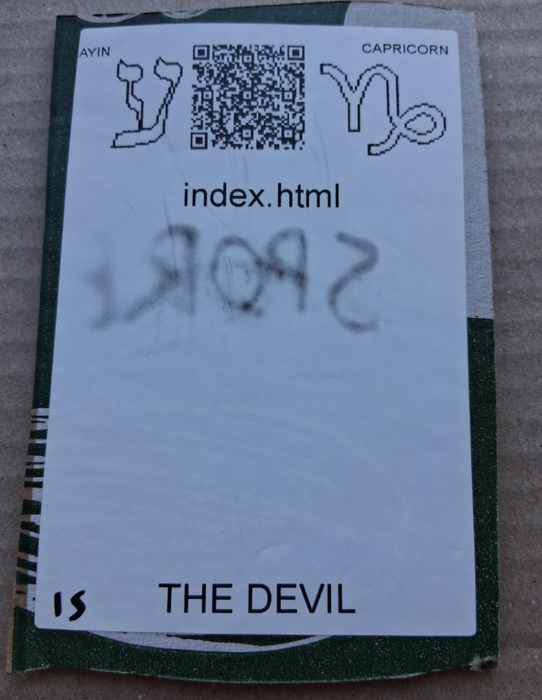

# [index.html](https://github.com/LafeLabs/spore/tree/main/tarot/spore/15)

[editor.html](https://github.com/LafeLabs/spore/blob/main/index.html) IS A VIRTUAL CARDBOARD SIGN!

# [THE DEVIL](https://en.wikipedia.org/wiki/The_Devil_(tarot_card))

USE 4 BY 6 INCH THERMAL PRINTER TO PRINT STIKERS AND PUT THEM ON THE CARDBOARD!

# [METASPORE](https://metaspore.net/tarot/spore/15/)
# [LOCALHOST](http://localhost/spore/tarot/spore/15/)
# [LOCALHOST/HERE](http://localhost/spore/tarot/spore/15/readme.html)
