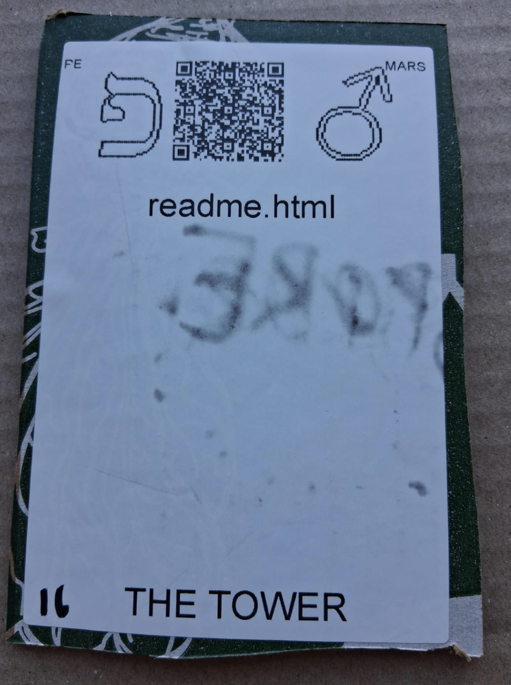

# [readme.html](https://github.com/LafeLabs/spore/tree/main/tarot/spore/16)

[readme.html](https://github.com/LafeLabs/spore/blob/main/readme.html) IS A WEB PAGE WHICH EDITS THE MARKDOWN FILE README.md!

# [THE TOWER](https://en.wikipedia.org/wiki/The_Tower_(tarot_card))

USE 4 BY 6 INCH THERMAL PRINTER TO PRINT STIKERS AND PUT THEM ON THE CARDBOARD!

# [METASPORE](https://metaspore.net/tarot/spore/16/)
# [LOCALHOST](http://localhost/spore/tarot/spore/16/)
# [LOCALHOST/HERE](http://localhost/spore/tarot/spore/16/readme.html)
