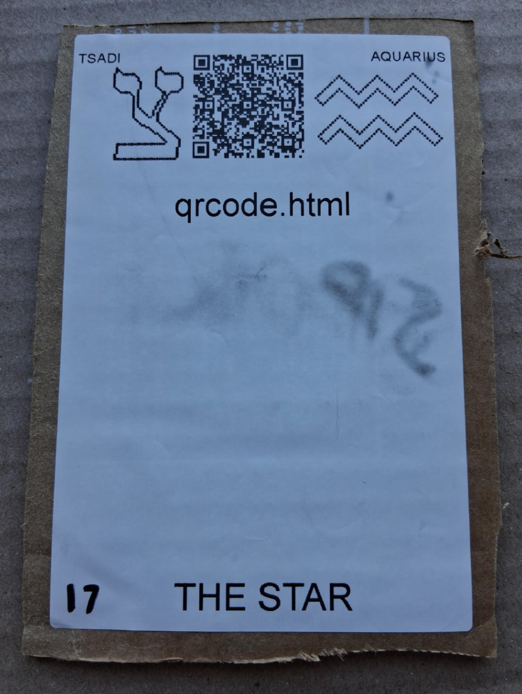

# [qrcode.html](https://github.com/LafeLabs/spore/tree/main/tarot/spore/17)

[qrcode.html](https://github.com/LafeLabs/spore/blob/main/qrcode.html) IS A WEB PAGE WHICH CREATES QR CODES!

## [LIVE INSTANCE ON METASPORE](https://metaspore.net/qrcode.html)

# [THE STAR](https://en.wikipedia.org/wiki/The_Star_(tarot_card))

USE 4 BY 6 INCH THERMAL PRINTER TO PRINT STIKERS AND PUT THEM ON THE CARDBOARD!

# [METASPORE](https://metaspore.net/tarot/spore/17/)
# [LOCALHOST](http://localhost/spore/tarot/spore/17/)
# [LOCALHOST/HERE](http://localhost/spore/tarot/spore/17/readme.html)
