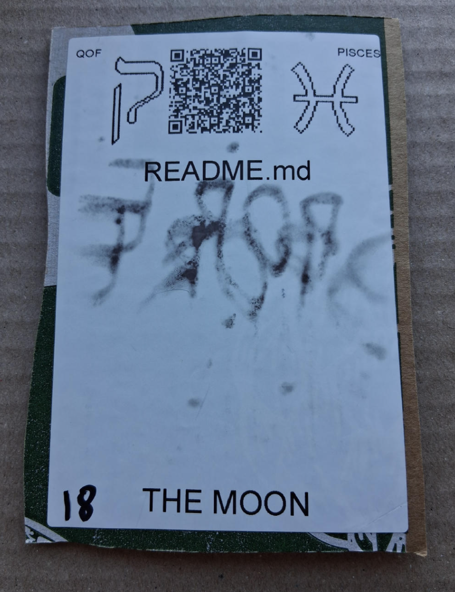

# [README.md](https://github.com/LafeLabs/spore/tree/main/tarot/spore/18)

[README.md](https://github.com/LafeLabs/spore/blob/main/README.md) IS THE REPLICATION SCROLL OF AN ENTITY!

# [THE MOON](https://en.wikipedia.org/wiki/The_Moon_(tarot_card))

USE 4 BY 6 INCH THERMAL PRINTER TO PRINT STIKERS AND PUT THEM ON THE CARDBOARD!

# [METASPORE](https://metaspore.net/tarot/spore/18/)
# [LOCALHOST](http://localhost/spore/tarot/spore/18/)
# [LOCALHOST/HERE](http://localhost/spore/tarot/spore/18/readme.html)

