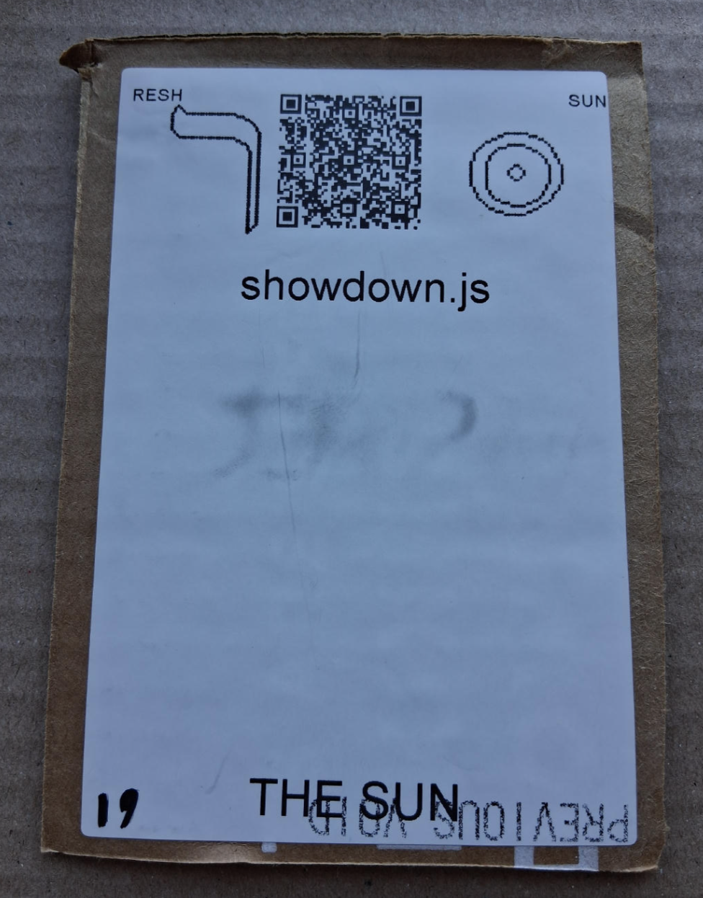

# [showdown.js](https://github.com/LafeLabs/spore/tree/main/tarot/spore/19)

[showdown.js](https://github.com/showdownjs/showdown) IS A JAVASCRIPT LIBRARY WHICH CONVERTS MARKDOWN TO HTML!

# [THE SUN](https://en.wikipedia.org/wiki/The_Sun_(tarot_card))

USE 4 BY 6 INCH THERMAL PRINTER TO PRINT STIKERS AND PUT THEM ON THE CARDBOARD!

# [METASPORE](https://metaspore.net/tarot/spore/18/)
# [LOCALHOST](http://localhost/spore/tarot/spore/18/)
# [LOCALHOST/HERE](http://localhost/spore/tarot/spore/18/readme.html)

