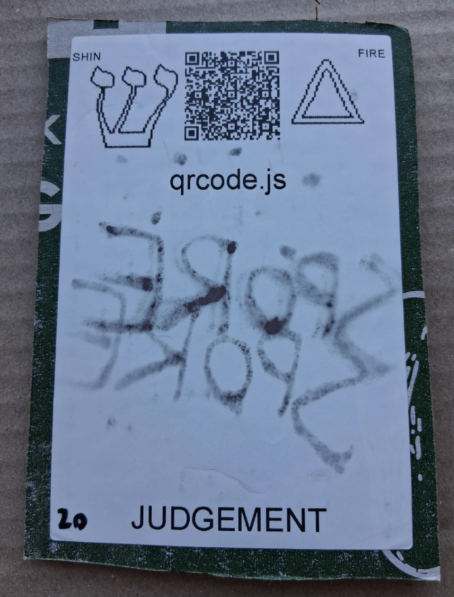

# [qrcode.js](https://github.com/LafeLabs/spore/tree/main/tarot/spore/20)

[qrcode.js](https://davidshimjs.github.io/qrcodejs/) IS A JAVASCRIPT LIBRARY WHICH CREATES QR CODES!

# [JUDEMENT](https://en.wikipedia.org/wiki/Judgement_(tarot_card))

USE 4 BY 6 INCH THERMAL PRINTER TO PRINT STIKERS AND PUT THEM ON THE CARDBOARD!

# [METASPORE](https://metaspore.net/tarot/spore/20/)
# [LOCALHOST](http://localhost/spore/tarot/spore/20/)
# [LOCALHOST/HERE](http://localhost/spore/tarot/spore/20/readme.html)

