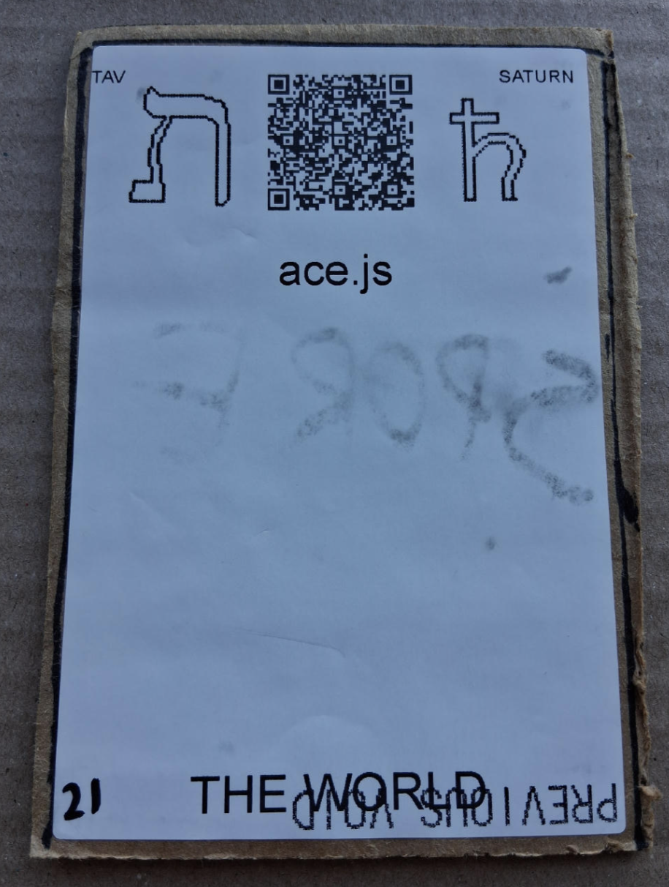

# [qrcode.js](https://github.com/LafeLabs/spore/tree/main/tarot/spore/20)

[ace.js](https://ace.c9.io/) IS A JAVASCRIPT LIBRARY WHICH PERFORMS SYNTAX HIGHLIGHTING ON CODE IN MANY LANGUAGES!

# [THE WORLD](https://en.wikipedia.org/wiki/The_World_(tarot_card))

USE 4 BY 6 INCH THERMAL PRINTER TO PRINT STIKERS AND PUT THEM ON THE CARDBOARD!

# [METASPORE](https://metaspore.net/tarot/spore/21/)
# [LOCALHOST](http://localhost/spore/tarot/spore/21/)
# [LOCALHOST/HERE](http://localhost/spore/tarot/spore/21/readme.html)

