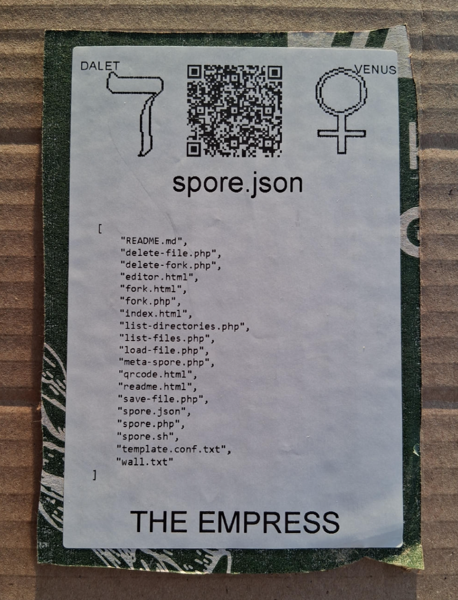

# [spore.json](https://github.com/LafeLabs/spore/tree/main/tarot/spore/3)




[spore.json](https://github.com/LafeLabs/spore/blob/main/spore.json) IS A [JSON](https://en.wikipedia.org/wiki/JSON) FILE WITH A LIST OF THE FILES IN THE SELF-REPLICATING FILE SET THAT IS THE SPORE!


```
[
    "README.md",
    "delete-file.php",
    "delete-fork.php",
    "editor.html",
    "fork.html",
    "fork.php",
    "index.html",
    "list-directories.php",
    "list-files.php",
    "load-file.php",
    "meta-spore.php",
    "qrcode.html",
    "readme.html",
    "save-file.php",
    "spore.json",
    "spore.php",
    "spore.sh",
    "template.conf.txt",
    "wall.txt"
]


```

# [THE EMPRESS](https://en.wikipedia.org/wiki/The_Empress_(tarot_card))


USE 4 BY 6 INCH THERMAL PRINTER TO PRINT STIKERS AND PUT THEM ON THE CARDBOARD!

# [METASPORE](https://metaspore.net/tarot/spore/0/)
# [LOCALHOST](http://localhost/spore/tarot/spore/0/)