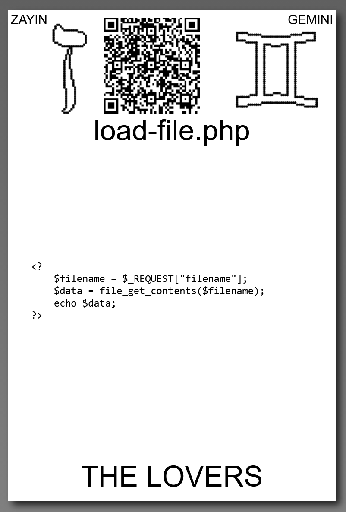

# [load-file.php](https://github.com/LafeLabs/spore/tree/main/tarot/spore/6)

[spore.php](https://github.com/LafeLabs/spore/blob/main/spore.php) IS A [PHP](https://en.wikipedia.org/wiki/PHP) SCRIPT WHITCH LOADS A FILE.

## load-file.php CODE:

```
    <?
        $filename = $_REQUEST["filename"];
        $data = file_get_contents($filename);
        echo $data;
    ?>
```

## [_REQUEST](https://www.php.net/manual/en/reserved.variables.request.php)
## [file_get_contents](https://www.php.net/manual/en/function.file-get-contents.php)
## [echo](https://www.php.net/manual/en/function.echo.php)



# [THE LOVERS](https://en.wikipedia.org/wiki/The_Lovers)


USE 4 BY 6 INCH THERMAL PRINTER TO PRINT STIKERS AND PUT THEM ON THE CARDBOARD!

# [METASPORE](https://metaspore.net/tarot/spore/6/)
# [LOCALHOST](http://localhost/spore/tarot/spore/6/)
# [LOCALHOST/HERE](http://localhost/spore/tarot/spore/6/readme.html)

