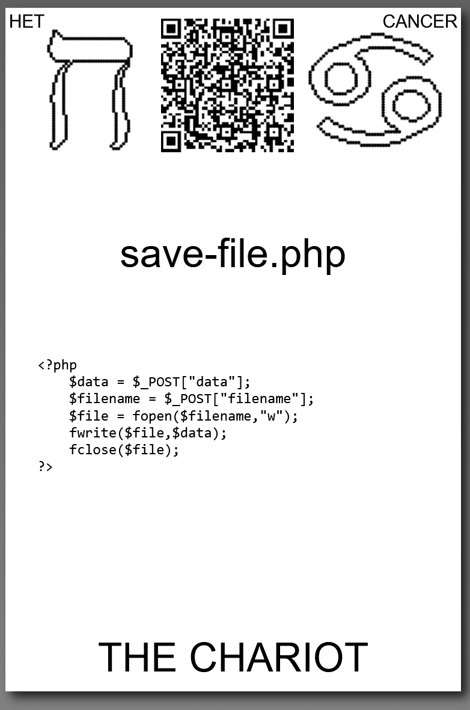

# [save-file.php](https://github.com/LafeLabs/spore/tree/main/tarot/spore/7)

[save-file.php](https://github.com/LafeLabs/spore/blob/main/save-file.php) IS A [PHP](https://en.wikipedia.org/wiki/PHP) SCRIPT WHITCH SAVES A FILE.

## [save-file.php](https://github.com/LafeLabs/spore/blob/main/save-file.php) CODE:

```
    $data = $_POST["data"]; 
    $filename = $_POST["filename"];
    $file = fopen($filename,"w");
    fwrite($file,$data); 
    fclose($file);
```

## [_POST](https://www.php.net/manual/en/reserved.variables.post.php)
## [fopen](https://www.php.net/manual/en/function.fopen.php)
## [fwrite](https://www.php.net/manual/en/function.fwrite.php)
## [fclose](https://www.php.net/manual/en/function.fclose.php)



# [THE CHARIOT](https://en.wikipedia.org/wiki/The_Chariot_(tarot_card))


USE 4 BY 6 INCH THERMAL PRINTER TO PRINT STIKERS AND PUT THEM ON THE CARDBOARD!

# [METASPORE](https://metaspore.net/tarot/spore/7/)
# [LOCALHOST](http://localhost/spore/tarot/spore/7/)
# [LOCALHOST/HERE](http://localhost/spore/tarot/spore/7/readme.html)

