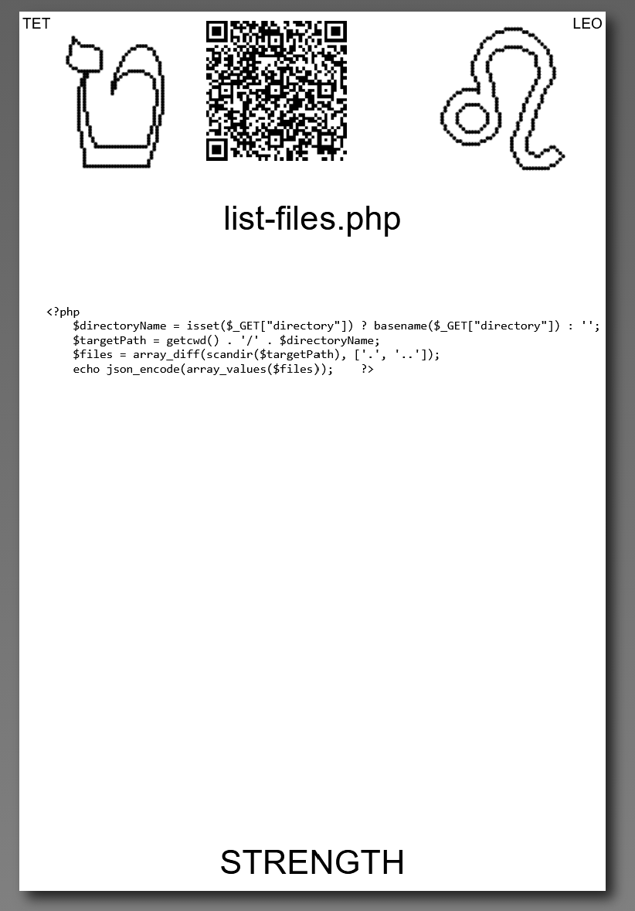

# [list-files.php](https://github.com/LafeLabs/spore/tree/main/tarot/spore/8)

[list-files.php](https://github.com/LafeLabs/spore/blob/main/list-files.php) IS A [PHP](https://en.wikipedia.org/wiki/PHP) SCRIPT WHITCH LISTS FILES.

## [list-files.php](https://github.com/LafeLabs/spore/blob/main/list-files.php) CODE:

```
<?php
        $directoryName = isset($_GET["directory"]) ? basename($_GET["directory"]) : '';
        $targetPath = getcwd() . '/' . $directoryName;
        $files = array_diff(scandir($targetPath), ['.', '..']);
        echo json_encode(array_values($files));    
?>
```




# [STRENGTH](https://en.wikipedia.org/wiki/Strength_(tarot_card))


USE 4 BY 6 INCH THERMAL PRINTER TO PRINT STIKERS AND PUT THEM ON THE CARDBOARD!

# [METASPORE](https://metaspore.net/tarot/spore/8/)
# [LOCALHOST](http://localhost/spore/tarot/spore/8/)
# [LOCALHOST/HERE](http://localhost/spore/tarot/spore/8/readme.html)

