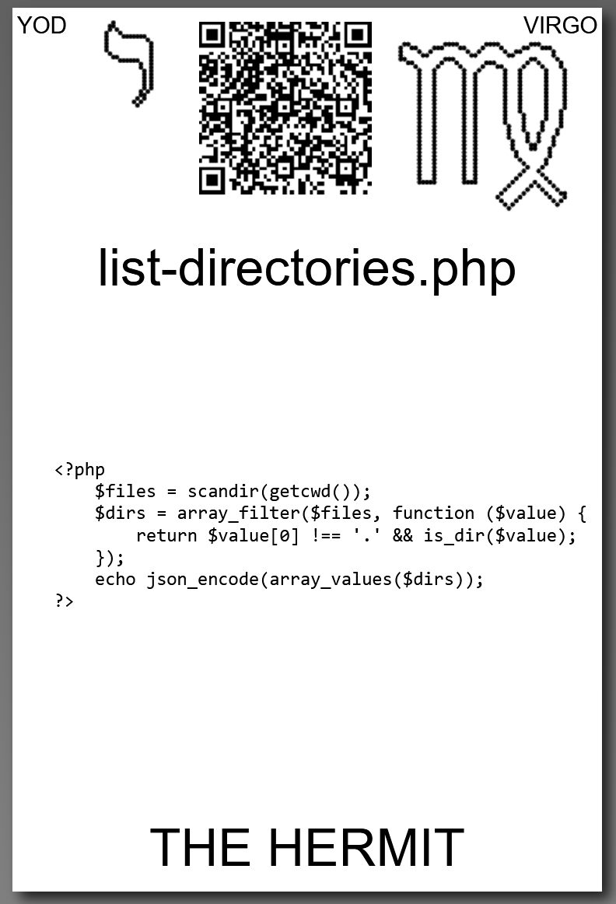

# [list-directories.php](https://github.com/LafeLabs/spore/tree/main/tarot/spore/9)

[list-directories.php](https://github.com/LafeLabs/spore/blob/main/list-files.php) IS A [PHP](https://en.wikipedia.org/wiki/PHP) SCRIPT WHITCH LISTS DIRECTORIES.

## [list-directories.php](https://github.com/LafeLabs/spore/blob/main/list-directories.php) CODE:

```
<?php
        $files = scandir(getcwd());
        $dirs = array_filter($files, function ($value) {
            return $value[0] !== '.' && is_dir($value);
        });
        echo json_encode(array_values($dirs));
?>
```

## [scandir](https://www.php.net/manual/en/function.scandir.php)
## [getcwd](https://www.php.net/manual/en/function.getcwd.php)
## [array_filter](https://www.php.net/manual/en/function.array-filter.php)
## [function](https://www.php.net/manual/en/functions.user-defined.php)
## [return](https://www.php.net/manual/en/function.return.php)
## [is_dir](https://www.php.net/manual/en/function.is-dir.php)
## [&&](https://www.php.net/manual/en/language.operators.logical.php)
## [!==](https://www.php.net/manual/en/language.operators.comparison.php)
## [echo](https://www.php.net/manual/en/function.echo.php)
## [json_encode](https://www.php.net/manual/en/function.json-encode.php)
## [array_values](https://www.php.net/manual/en/function.array-values.php)




# [THE HERMIT](https://en.wikipedia.org/wiki/The_Hermit_(tarot_card))


USE 4 BY 6 INCH THERMAL PRINTER TO PRINT STIKERS AND PUT THEM ON THE CARDBOARD!

# [METASPORE](https://metaspore.net/tarot/spore/9/)
# [LOCALHOST](http://localhost/spore/tarot/spore/9/)
# [LOCALHOST/HERE](http://localhost/spore/tarot/spore/9/readme.html)

